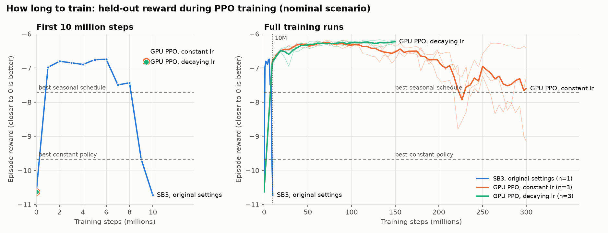
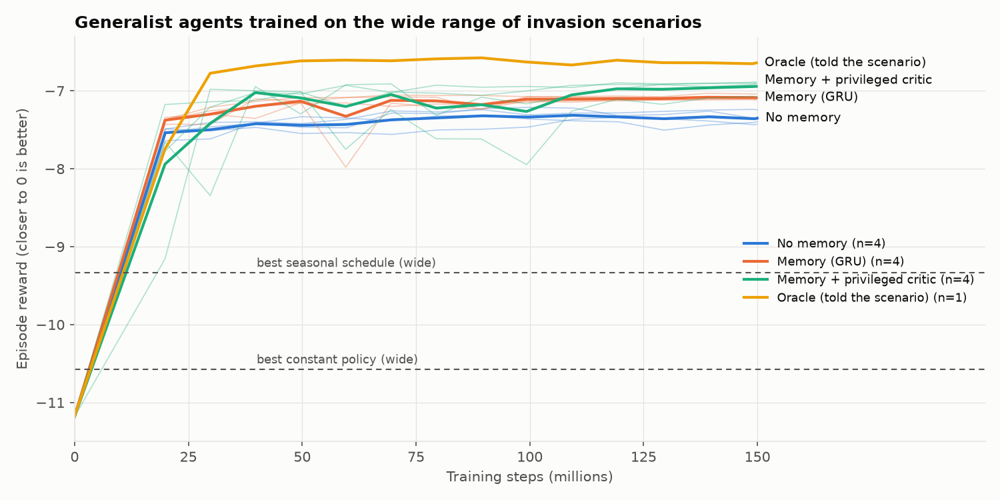
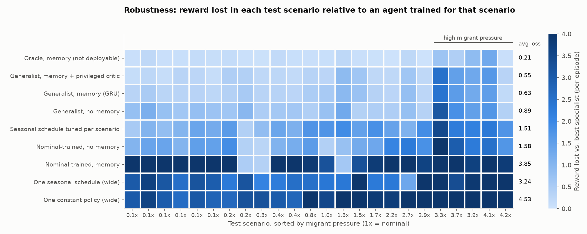

# GPU experiments: faster simulation and robust RL policies for green crab management

This folder contains the experiments run with the GPU (graphics card) version of the green crab simulation. The goals were (1) to make simulation and RL training fast enough to ask questions that were impractical before, and (2) to use that speed to test how good, how stable, and how robust the RL trapping policies are.

## Top-level findings

1. **The GPU simulator is ~900x faster, and RL training ~130x faster.** One CPU process simulates ~6,500 crab-months per second; the GPU version simulates ~5.9 million. Training an RL agent for 10 million steps drops from about an hour to under a minute. This made the hundreds of training runs below possible.

2. **A bug in the original simulator was found and fixed.** Recruits from the end of one simulated episode carried over into the first year of the next one ([issue #39](https://github.com/boettiger-lab/rl4greencrab/issues/39)). All GPU results use the corrected model. The manuscript's agents, re-scored on the corrected model, still perform about as reported.

3. **Most of RL's advantage over a constant trapping policy comes from seasonality.** A fixed month-by-month trapping schedule (no observations used) closes most of the gap between the best constant policy and the manuscript's RL agents. Responding to catch data adds a smaller, real improvement on top.

4. **Training length and settings matter more than expected.** With the settings used in the manuscript, PPO peaked within a few million steps and then *degraded*. With a decaying learning rate and keeping the best checkpoint, training is stable and keeps improving to roughly 100 million steps. 10 million steps was not enough with our GPU settings.

5. **Policies trained on one scenario are brittle.** An agent trained only on the manuscript's nominal model is excellent there but performs poorly when the invasion differs (different carrying capacity, migrant pressure, etc.). The more capable the agent (agents with memory), the more brittle it is when trained narrowly.

6. **A single agent can handle a wide range of invasion scenarios.** Trained across a broad range of uncertain conditions, one agent with memory comes within ~0.55 reward points per episode of agents trained separately for each specific scenario, and far outperforms fixed schedules.

7. **The remaining shortfall is concentrated in high-migration scenarios, and it is a timing problem.** Where migrant pressure is very high, the best strategy front-loads trapping early in the season. The broadly trained agent instead keeps the usual late-season pattern, just with more traps. The needed information is in the catch data; these scenarios were simply too rare in training. A follow-up that over-samples them is in progress.

## Key terms

| Term | Meaning here |
|---|---|
| **Episode** | One simulated management period: 101 monthly decisions (about 14 years of April-October trapping seasons). |
| **Reward / score** | The quantity the agent maximizes, summed over an episode: ecological damage (a function of crab biomass) plus the cost of traps. It is always negative; **closer to zero is better**. Typical values are -6 to -10; doing nothing scores about -23. |
| **Policy / agent** | A rule mapping what the manager observes (catch per trap, mean size of caught crabs, month) to how many minnow and Fukui traps to set. |
| **Constant policy** | Same number of traps every month, regardless of observations. |
| **Seasonal schedule** | A fixed number of traps for each calendar month (same every year), regardless of observations. |
| **Nominal scenario** | The manuscript's model: carrying capacity 25,000, usual migrant pressure, 0-2,000 initial adults. |
| **Wide scenarios** | A broad range of invasion conditions (table below), drawn at random each episode. |
| **Generalist** | An agent trained on the wide range of scenarios. |
| **Specialist** | An agent trained on one specific scenario only. Used as a yardstick for what is achievable in that scenario. |
| **Regret** | How much reward a policy loses in a scenario compared with the best specialist for that scenario. 0 = as good as the specialist; -0.5 = half a reward point worse per episode. |
| **Oracle** | An agent that is *told* the true scenario parameters (carrying capacity, migrant pressure, ...). Not usable in practice; it measures how much is lost by not knowing the scenario. |
| **Privileged critic** | A training aid. RL training uses a second network (the "critic") that estimates future reward to score the agent's choices. A privileged critic is shown the true hidden state of the simulation during training only. The deployed policy never sees it, so the resulting agent is usable in practice. |
| **Memory (recurrent / transformer)** | Agents that remember the whole catch history of the episode instead of only the latest observation. |
| **Seed** | An independent replicate training run. Results are averaged over seeds. |

**The wide scenario range:**

| Parameter | Nominal | Wide range |
|---|---|---|
| Initial adult crabs | 0-2,000 | 0-20,000 |
| Carrying capacity K | 25,000 | 10,000-60,000 |
| Local recruitment rate r | 1 | 0.5-2 |
| Migrant (propagule) pressure | 1x | 0.1x-5x |
| Probability of a large migration pulse in a year | 0.2 | 0-0.5 |

Biological parameters (growth, mortality, trap selectivity) are drawn from the Bayesian posterior in every episode in all experiments, as in the manuscript.

## What was built

- **GPU simulator** (`src/rl4greencrab/envs/gpu_env.py`): the same population model as the original environment, run for thousands of independent episodes at once. Its growth kernels, trap selectivity, initial state and reward match the original to numerical precision, and whole-episode results agree statistically (`tests/test_gpu_env.py`).
- **GPU training algorithms** (`src/rl4greencrab/agents/`): PPO (`gpu_ppo.py`), PPO with memory (GRU or transformer; `gpu_rppo.py`) and TD3 (`gpu_td3.py`), all running entirely on the GPU.
- Tools to evaluate any policy (including the manuscript's saved agents) on thousands of episodes in seconds.

## Experiments

All scores below are average episode rewards on held-out simulations (thousands of episodes, so sampling error is about +/-0.02 unless noted).

### 1. Baselines on the corrected model

| Policy | Score |
|---|---|
| No trapping | -23.16 |
| Best constant policy | -9.67 |
| Best seasonal schedule | -7.71 |
| Manuscript agents (TQC, catch + biomass + month), mean of 10 | -7.36 |
| Best manuscript agent (any algorithm) | -6.71 |

The best seasonal schedule sets almost no traps from April to July and traps heavily in August-October. That simple pattern accounts for most of the improvement over the constant policy (finding 3). Scored on the original (buggy) model, the manuscript agents reproduce the manuscript's Table 1 closely, which confirms the GPU simulator matches the original.

### 2. How long should we train?

| Training setup | Score at 10M steps | Best score | What happened later |
|---|---|---|---|
| Original settings (SB3 PPO, 12 envs) | collapsed (-10.7) | -6.74 (at 6M) | degraded after ~6M steps |
| GPU PPO, constant learning rate | -6.81 | -6.24 | 2 of 3 replicates degraded badly by 300M |
| GPU PPO, decaying learning rate | -6.83 | **-6.21** | stable; plateau by ~100M |



*Figure 1. Held-out reward during training (higher is better). Left: the first 10 million steps. The original settings (blue) learn fast, then collapse. The GPU runs were only evaluated at 0 and ~9.4M steps in this window, so they are shown as points. Right: full runs. With a constant learning rate (orange), two of three replicates degrade after ~150M steps; with a decaying learning rate (green), training is stable. Thin lines are individual replicates, thick lines their mean.*

The original settings learn quickly per step but are unstable; this likely explains part of the large variation between replicate agents in the manuscript. A decaying learning rate plus keeping the best-scoring checkpoint gives reliable training (finding 4).

### 3. Algorithm and setting variations on the nominal model

- **Discounting** (gamma 0.999 instead of 0.99): slightly worse.
- **Larger networks, observation history, squashed actions**: no improvement.
- **TD3** (an off-policy algorithm): about as good as PPO (-6.26), not better. Because simulation is cheap, PPO's need for many samples is no handicap.
- **Agents with memory (GRU)**: best on the nominal model (**-5.99**).

### 4. Robustness across invasion scenarios

Each policy was scored on 24 fixed test scenarios drawn from the wide range. "Regret" compares each scenario with the best specialist trained for that scenario.

| Policy | Score, nominal | Score, wide | Average regret | Worst-scenario regret |
|---|---|---|---|---|
| Oracle with memory (not deployable) | -6.06 | -6.56 | -0.21 | -1.28 |
| **Generalist with memory + privileged critic** (4 seeds) | -6.39 | **-6.90** | **-0.55** | -2.48 |
| Generalist with memory (transformer) | -6.69 | -6.99 | -0.60 | -2.43 |
| Generalist with memory (GRU) | -6.63 to -6.74 | -7.03 to -7.09 | -0.63 to -0.68 | -2.4 to -2.7 |
| Generalist without memory | -6.70 | -7.26 | -0.89 | -3.11 |
| Generalist without memory + curriculum | -6.53 | -7.29 | -0.93 | -3.15 |
| Seasonal schedule tuned *for each scenario* | -7.77 | -9.33 | -1.51 | -3.46 |
| Agent without memory trained on nominal only | -6.19 | -7.73 | -1.58 | -4.60 |
| **Agent with memory trained on nominal only** | **-5.99** | -9.69 | **-3.85** | -6.41 |
| One seasonal schedule tuned on the wide range | — | -9.33 | -3.24 | -6.28 |
| One constant policy tuned on the wide range | — | -10.57 | -4.53 | -10.35 |



*Figure 2. Held-out reward on the wide range of invasion scenarios during training. Memory and a privileged critic each add a step up. The oracle, which is told the scenario, shows how much is lost by having to infer it from catches.*



*Figure 3. Reward lost in each of the 24 test scenarios (columns, sorted by migrant pressure) relative to an agent trained for that scenario. Darker = larger loss; the right-hand numbers are the average loss. The few cases where a policy slightly beat the specialist are shown as 0. Values are in `results/figures/fig3_regret_table.csv`.*

What this shows:
- **Train on the uncertainty you actually have.** The agent with memory trained only on the nominal model is the best of all on the nominal model, and one of the worst anywhere else (finding 5).
- **Memory helps most.** Remembering the catch history reduces regret from -0.89 to about -0.6.
- **A privileged critic helps a little more** (-0.55). It reaches the same performance as training twice as long.
- **Other tricks did not help:** a curriculum (gradually widening the scenarios during training), larger networks, longer training, transformers instead of GRUs, and an auxiliary task asking the memory to predict the hidden state.
- **About half of the remaining gap is the cost of not knowing the scenario**: the oracle reaches -0.21.

### 5. Why do generalists fall short in high-migration scenarios?

The four hardest test scenarios all have 3-4x the usual migrant pressure. There the generalist loses 1.3-2.5 reward points to the specialist. Comparing behavior (`behavior_hard.py`):

- The generalist does **not** under-trap. It sets about as many traps in total as the specialist.
- It **mis-times** them. Specialists and the oracle trap heavily in April-June and lightly in October. The generalist keeps the nominal pattern (light early, heavy August-October) and just scales it up.
- The result: in the hardest scenario, the generalist leaves 40-46k crabs where the specialist holds 28-33k.
- By the later years the catch data clearly shows the high abundance, so the information is available. Scenarios with more than 3x migrant pressure were only ~13% of training episodes, too few to learn a different strategy.

**In progress:** training generalists that over-sample high-migration scenarios (half of episodes from the high-pressure range, or a uniform rather than log-uniform spread of migrant pressure), to test whether this closes the gap without hurting other scenarios.

### 6. Speed

Measured on the NVIDIA GB10 (DGX Spark):

| Task | Original (CPU) | GPU | Speed-up |
|---|---|---|---|
| Simulation, steps per second | 6,500 (1 core); 18,500 (20 cores) | 5.9 million | ~900x (1 core), ~300x (20 cores) |
| PPO training, steps per second | 2,900 (manuscript setup) | 385,000 (447,000 with CUDA graphs) | ~130-150x |
| GRU (memory) agent training | — | 166,000 (196,000 with TF32) | |
| Transformer agent training | — | 66,000 (78,000 with TF32) | |

Two optional speed-ups are switched on automatically where they help and the hardware supports them: **CUDA graphs**, which replay the simulation step without per-operation overhead, and **TF32 tensor cores** for the neural networks only. Neither changes the simulated population dynamics: the population projection always runs in full 32-bit precision. On older GPUs (e.g. the Quadro RTX 8000) or CPU, the code falls back automatically. Simulator throughput with CUDA graphs after the final optimizations: 2.9M (1,024 parallel episodes), 5.4M (4,096) and 5.85M (16,384) steps per second.

## Caveats

- Results are from simulation. The wide scenario ranges are our choice and should be reviewed by the team for ecological plausibility.
- The "best checkpoint" of each training run is selected on the same held-out simulations that are reported in the learning curves. This slightly flatters those curves. The 24-scenario comparisons use separate test scenarios and are the fairer comparison.
- Some configurations have 1-2 replicate seeds only (noted in the tables); differences smaller than ~0.05 in average regret are not meaningful.

## Files

| File | Purpose |
|---|---|
| `common.py` | Shared setup: scenario definitions (nominal, wide), evaluation helpers |
| `baselines.py` | Constant and seasonal policies; re-scoring the manuscript's agents |
| `train_ppo.py` | Train one agent (PPO, with or without memory, any scenario setting); writes a learning curve and the best checkpoint |
| `train_td3.py` | Train a TD3 agent |
| `train_sb3_ref.py` | Reference run with the original SB3 settings |
| `scenario_baselines.py` | Best constant and seasonal policies for each test scenario |
| `eval_scenarios.py`, `analyze_scenarios.py` | Score agents on the test scenarios; regret tables |
| `behavior_hard.py` | Behavior comparison in high-migration scenarios |
| `make_figures.py` | Regenerates the figures in `results/figures/` from the results files |
| `benchmark.py`, `benchmark_speedups.py` | Speed benchmarks |
| `jobs_*.txt`, `run_jobs.sh` | The exact training runs, launched in parallel |
| `results/` | All results: `baselines.csv`, `scenario_summary.csv` (main robustness table), `scenario_eval*.csv`, `behavior_hard.csv`, `benchmark*.csv`, and `curves/` (learning curves for every run) |

To reproduce a run, e.g. the best generalist:

```
python train_ppo.py --tag my-run --recurrent --critic privileged --scenario wide --anneal --seq-minibatches 32 --steps 1.5e8
python eval_scenarios.py results/my_eval.csv my-run-best
```
